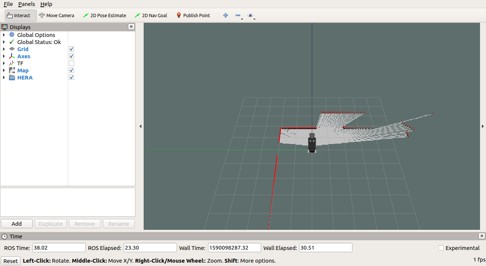
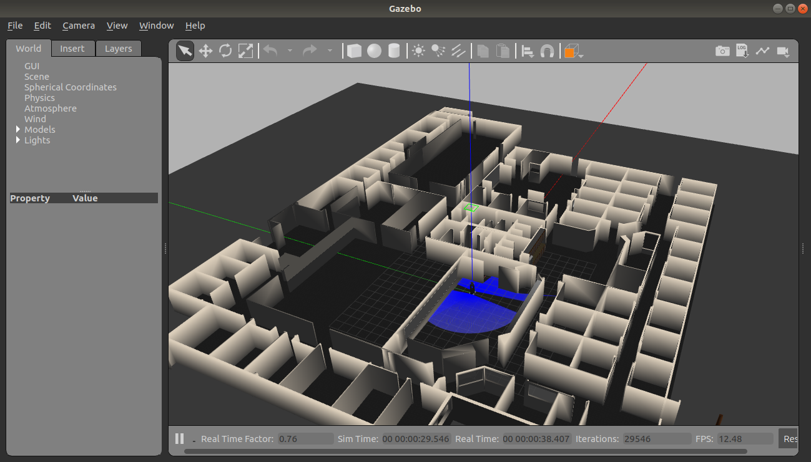
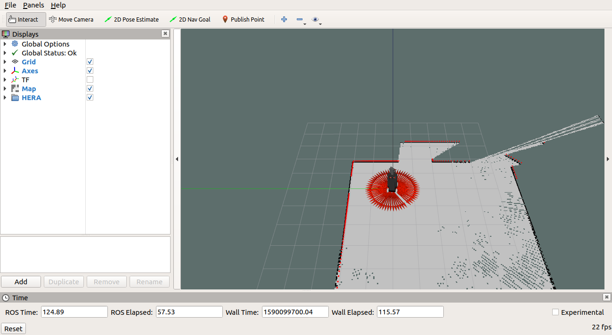
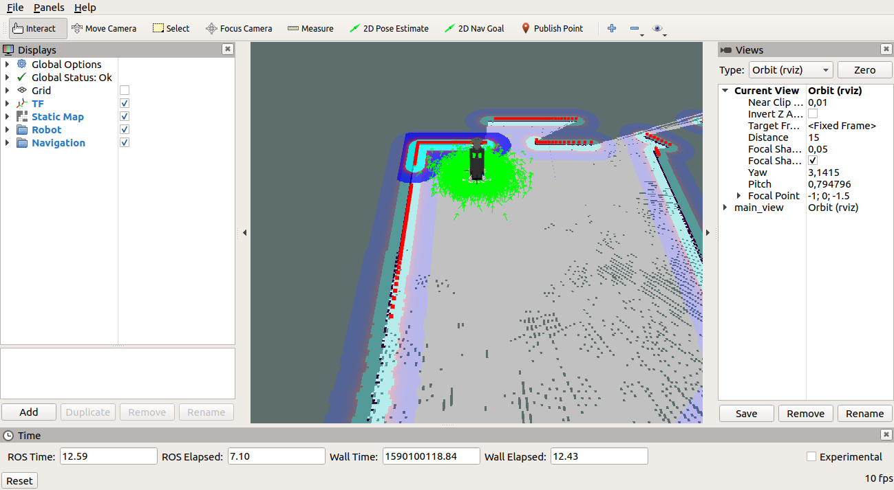
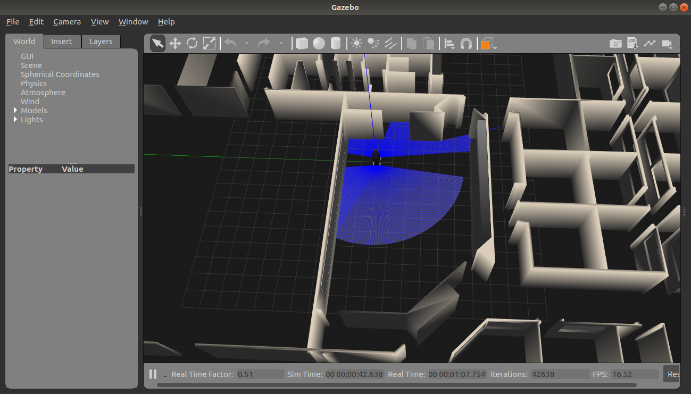

##Hera Bringup
Contains all configs and resources necessary for bringing up hera robot

This package is an implementation of the [Ros Navigation Stack (RNS)](http://wiki.ros.org/navigation) for the [HERA robot (2020 version)](http://robofei.aquinno.com/athome/wp-content/uploads/2020/01/TDP2020ROBOFEI.pdf).


# hera_nav

This package is an implementation of the [Ros Navigation Stack (RNS)](http://wiki.ros.org/navigation) for the [HERA (2020 version)](http://robofei.aquinno.com/athome/wp-content/uploads/2020/01/TDP2020ROBOFEI.pdf).
The [RNS]((http://wiki.ros.org/navigation)) is a set of packages from [ROS](https://www.ros.org/) specialized in navigating a mobile base. It uses information from [odometry](https://en.wikipedia.org/wiki/Odometry) and distance sensors ([laser scanning](https://en.wikipedia.org/wiki/Laser_scanning) and [point cloud](https://en.wikipedia.org/wiki/Point_cloud)) to generate speed commands sent to the robot.

<figure align="center">

<p>Navigation Stack Setup.</p>
</figure>

## Dependencies:
* [ROS](https://www.ros.org/) (Melodic Morenia)
  * [roslaunch](http://wiki.ros.org/roslaunch)
  * [rviz](http://wiki.ros.org/rviz)
  * [ROS Navigation Stack](http://wiki.ros.org/navigation)
    * [teleop_twist_keyboard](http://wiki.ros.org/teleop_twist_keyboard)
    * [gmapping](http://wiki.ros.org/gmapping)
    * [map_server](http://wiki.ros.org/map_server)
    * [move_base](http://wiki.ros.org/move_base)
    * [costmap_2d](http://wiki.ros.org/costmap_2d)
    * [amcl](http://wiki.ros.org/amcl)
    * [fake_localization](http://wiki.ros.org/fake_localization)
    * [navfn](http://wiki.ros.org/navfn)
    * [carrot_planner](http://wiki.ros.org/carrot_planner)
    * [global_planner](http://wiki.ros.org/global_planner)
    * [base_local_planner](http://wiki.ros.org/base_local_planner)
    * [dwa_local_planner](http://wiki.ros.org/dwa_local_planner)
    * [eband_local_planner](http://wiki.ros.org/eband_local_planner)
    * [teb_local_planner](http://wiki.ros.org/teb_local_planner)
    <!-- * [clear_costmap_recovery](http://wiki.ros.org/clear_costmap_recovery) -->
    <!-- * [rotate_recovery](http://wiki.ros.org/rotate_recovery) -->
    <!-- * [move_slow_and_clear](http://wiki.ros.org/move_slow_and_clear) -->
* [hera_description](https://github.com/Home-Environment-Robot-Assistant/hera_description)

### Configuration:
There are a folder called ```config```, that contains parameters used to visualize and configure the robot navigation.
```
  |-- config
    |-- localization
      |-- amcl.yaml
      |-- fl.yaml
    |-- move_base
      |--move_base_params.yaml
      |--costmap_common_params.yaml
      |--costmap_global_params.yaml
      |--costmap_local_params.yaml
      |--local_planner_base_params.yaml
      |--local_planner_dwa_params.yaml
      |--local_planner_eband_params.yaml
      |--local_planner_teb_params.yaml
    |-- rviz
      |-- mapping.rviz
      |-- navigation.rviz
```

The parameters were set and optimized following the [Navigation tutorials](http://wiki.ros.org/navigation/Tutorials), [Configuring Layered Costmaps tutorial
](http://wiki.ros.org/costmap_2d/Tutorials/Configuring%20Layered%20Costmaps), [teb_local_planner tutorials](http://wiki.ros.org/teb_local_planner/Tutorials) and [ROS Navigation Tuning Guide](https://github.com/zkytony/ROSNavigationGuide/blob/master/main.pdf).


<!-- #### Localization optimization
For localization propose, two modules can be used, the first one is the [amcl package](http://wiki.ros.org/amcl) that implements [Adaptive (or KLD-sampling) Monte Carlo Localization approach by Dieter Fox *et al.*](https://www.aaai.org/Papers/AAAI/1999/AAAI99-050.pdf) and the [fake_localization package](http://wiki.ros.org/fake_localization) used during simulation as a method to provide perfect localization in a computationally inexpensive manner.
Both packages was used with default parameters without any kind of optimization.

#### Navigation optimization

##### move_base
Tree parameters was modified from default:
* **controller_frequency**: from ```20.0``` to ```5.0``` (The rate in Hz at which to run the control loop and send velocity commands to the base.)
* **recovery_behavior_enabled**: from ```true``` to ```false``` (Whether or not to enable the move_base recovery behaviors to attempt to clear out space.)
* **planner_frequency**: from ```0.0``` to ```1.0``` (The rate in Hz at which to run the global planning loop. If the frequency is set to 0.0, the global planner will only run when a new goal is received or the local planner reports that its path is blocked.)

##### recovery_behaviors
Since the parameter **recovery_behavior_enabled** is setted to ```false```, any optimization is needed in this topic.

##### costmaps
##### global_planners
##### local_planner -->

### Launch:
There are a folder called ```launch```, that contains files used to launch the robot using [roslaunch](http://wiki.ros.org/roslaunch) in the [ROS ecosystem](https://www.ros.org/core-components/).
The files in this folder are divided in two extensions:
* xml - for intern use (they are not visible in the roslaunch system).
* launch - for public use.
```
  |-- launch
    |--localization.xml
    |--navigation.xml
    |--bringup_mapping.launch
    |--bringup_navigation.launch
```
* **bringup_mapping**: Used to start the mapping process of a new environment. Parameters:
  * **robot_model**: (string, default: hera_full) - Robot used. Available in the [hera_description](https://github.com/Home-Environment-Robot-Assistant/hera_description) package.
* **bringup_navigation**: Used to start the navigation process. Parameters:
  * **robot_model**: (string, default: hera_full) - Robot used. Available in the [hera_description](https://github.com/Home-Environment-Robot-Assistant/hera_description) package.
  * **map_resource**: (string, default: ) - Path to map folder used to navigation. This folder must contain a _pgm_ and a _yaml_ files.
  * **use_fake_localization**: (boolean, default: false) - Used in simulated environment if you want an accurate localization.
    * **true** - Use [fake_localization](http://wiki.ros.org/fake_localization) package.
    * **false** - Use [amcl](http://wiki.ros.org/amcl) package.
  * **global_planner**: (string, default: navfn/NavfnROS) - Global planer used to plan the navigation.
  * **local_planner**: (string, default: eband_local_planner/EBandPlannerROS) - Local planner used to navigate. There are four available:
    * [base_local_planner/TrajectoryPlannerROS](http://wiki.ros.org/base_local_planner)
    * [dwa_local_planner/DWAPlannerROS](http://wiki.ros.org/dwa_local_planner)
    * [eband_local_planner/EBandPlannerROS](http://wiki.ros.org/eband_local_planner)
    * [teb_local_planner/TebLocalPlannerROS](http://wiki.ros.org/teb_local_planner)


# How to use this repository

1. Make sure do you have a [ROS environment](http://wiki.ros.org/melodic/Installation/Ubuntu) installed and ready.
2. [Create your catkin workspace](http://wiki.ros.org/catkin/Tutorials/create_a_workspace)
3. Create a ```src``` folder in your catkin workspace (if it doesn't exist).
```bash
cd <catkin_workspace>/
mkdir src
```
4. Git clone this repository and install all dependencies.
```bash
cd src
git clone https://github.com/Home-Environment-Robot-Assistant/hera_nav.git
sudo ./hera_description/install_dependencies.sh
```
5. Install [hera_description](https://github.com/Home-Environment-Robot-Assistant/hera_description).
6. Compile you catkin workspace.
```bash
cd <catkin_workspace>/
catkin_make
source devel/setup.bash
```
7. Now you are ready to run the launch files.
  1. Mapping:

```bash
source devel/setup.bash
roslaunch gazebo_ros willowgarage_world.launch
```

```bash
source devel/setup.bash
roslaunch hera_nav bringup_mapping.launch
```

You will be able to see this interface for rviz:
<figure align="center">

<p>RViz interface.</p>
</figure>

This interface for gazebo:
<figure align="center">

<p>Gazebo interface.</p>
</figure>

And this interface for teleop:
<figure align="center">

<p>Teleop interface.</p>
</figure>

With the teleop interface you can control the robot navigation to build a map.

<figure align="center">

<p>Map in RViz.</p>
</figure>

When finish, you can use this command to save your map.

```bash
rosrun map_server map_saver
```

  2. Navigation:

```bash
source devel/setup.bash
roslaunch gazebo_ros willowgarage_world.launch
```

```bash
roslaunch hera_nav bringup_navigation.launch map_resource:=<path_to_map_folder>
```

You will be able to see this interface for rviz:
<figure align="center">

<p>RViz interface.</p>
</figure>

This interface for gazebo:
<figure align="center">

<p>Gazebo interface.</p>
</figure>


<!-- http://www.willowgarage.com/sites/default/files/icra2010_marder-eppstein.pdf -->

<!-- https://estudogeral.uc.pt/handle/10316/87917 -->
